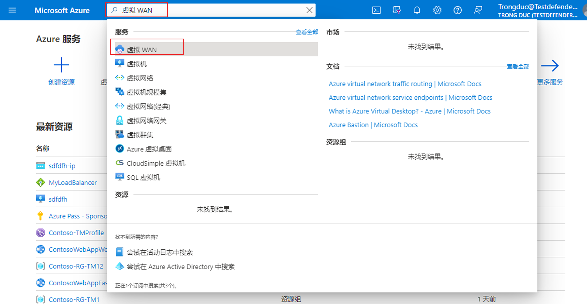
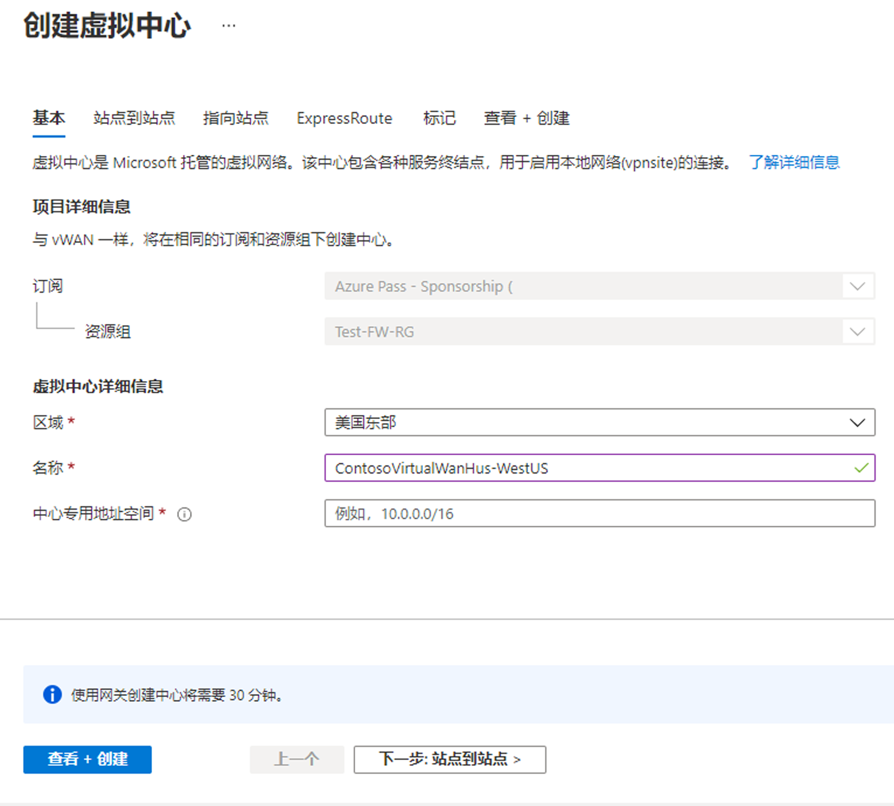
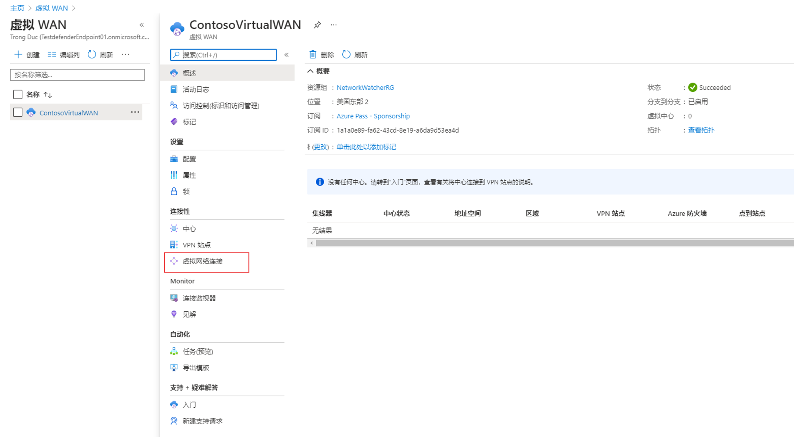

---
Exercise:
    title: '模块 02-第 7 单元 使用 Azure 门户创建虚拟 WAN'
    module: '模块 - 设计和实现混合网络'
---

# 模块 02-第 7 单元 使用 Azure 门户创建虚拟 WAN


在本练习中，需为 Contoso 创建一个虚拟 WAN。

在本练习中，你将：

+ 任务 1：创建虚拟 WAN
+ 任务 2：使用 Azure 门户创建中心
+ 任务 3：将 VNet 连接到虚拟中心
+ 任务 4：清理资源


## 任务 1：创建虚拟 WAN

1. 从浏览器导航到 Azure 门户并使用 Azure 帐户登录。

2. 在门户的搜索框中键入“虚拟 WAN”，然后在结果列表中选择“**虚拟 WAN**”。

   

 

3. 在“虚拟 WAN”页上，选择“**+ 创建**”。 

4. 在“创建 WAN”页的“**基本信息**”选项卡上，填写以下字段：

   - **订阅：** 使用现有订阅

   - **资源组：** ContosoResourceGroup

   - **资源组位置：** 从下拉列表中选择资源位置。WAN 是一个全局资源，不会驻留在某个特定区域。但是，必须选择一个区域才能管理和查找所创建的 WAN 资源。

   - **名称：** ContosoVirtualWAN

   - **类型：** 标准 

5. 填写完字段后，单击“**查看 + 创建**”。

6. 验证通过后，选择“**创建**”以创建虚拟 WAN。

## 任务 2：使用 Azure 门户创建中心

中心包含适用于站点到站点、ExpressRoute 或点到站点功能的网关。在虚拟中心创建站点到站点 VPN 网关需要 30 分钟时间。必须先创建虚拟 WAN，然后才能创建中心。

1. 找到创建的虚拟 WAN。 
2. 在“虚拟 WAN”页上的“**连接性**”部分下，选择“**中心**”。
3. 在“中心”页上，选择“**+ 新建中心**”以打开“创建虚拟中心”页。
   
4. 在“创建虚拟中心”页上的“**基本信息**”选项卡上，请填写以下字段：
   - **区域：** 美国西部
   - **名称：** ContosoVirtualWANHub-WestUS
   - **中心专用地址空间：** 10.60.0.0/24
5. 选择“**下一步: 站点到站点**”。
6. 在“**站点到站点**” 选项卡上填写以下字段：
   - **是否要创建站点到站点（VPN 网关）？：** 是
   - “**AS 编号**”字段无法编辑。
   - **网关缩放单元：** 1 个缩放单元 = 500 Mbps
7. 选择“**查看 + 创建**”以进行验证。
8. 选择“**创建**”以创建中心。 
9. 30 分钟后，“**刷新**”以在“中心”页上查看该中心。 

## 任务 3：将 VNet 连接到虚拟中心

1. 找到创建的虚拟 WAN。 

2. 在“ContosoVirtualWAN”中的“**连接性**”下，选择“**虚拟网络连接**”。

   

3. 在 ContosoVirtualWAN | 虚拟网络连接上，选择“**+ 添加连接**”。

4. 在“添加连接”中，使用以下信息创建连接。

   - **连接名称：** ContosoVirtualWAN-to-ResearchVNet

   - **中心：** ContosoVirtualWANHub-WestUS

   - **订阅：** 无更改

   - **资源组：** ContosoResourceGroup

   - **虚拟网络：** ResearchVNet

   - **传播到无：** 是

   - **关联路由表：** 默认

5. 选择“**创建**”。

 

恭喜！你已创建虚拟 WAN 和虚拟 WAN 中心，并已将 ResearchVNet 连接到中心。

## 任务 4：清理资源

   >**备注**： 请记得删除不再使用的所有新创建的 Azure 资源。删除未使用的资源，确保不产生意外费用。

1. 在 Azure 门户中，在“**Cloud Shell**”窗格中打开“**PowerShell**”会话。

1. 运行以下命令，删除在本模块各个实验室中创建的所有资源组：

   ```powershell
   Remove-AzResourceGroup -Name 'NAME OF THE RG' -Force -AsJob
   ```

    >**备注**： 该命令以异步方式执行（由 -AsJob 参数决定），因此，虽然你随后可在同一 PowerShell 会话中立即运行另一个 PowerShell 命令，但实际上要花几分钟才能删除资源组。
