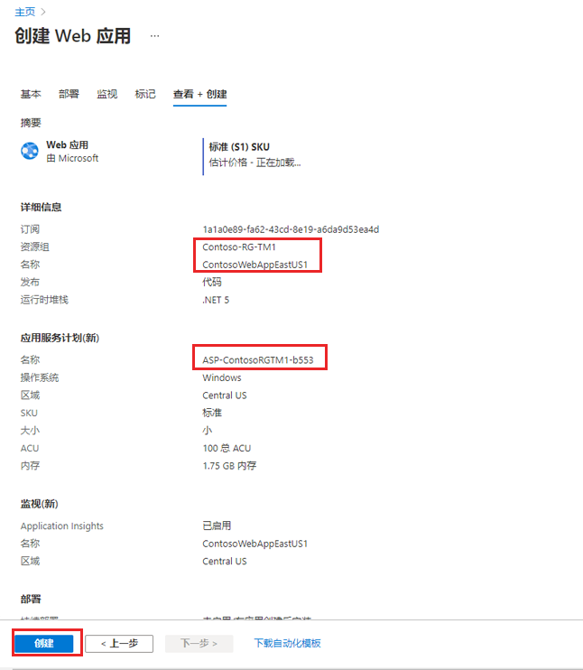
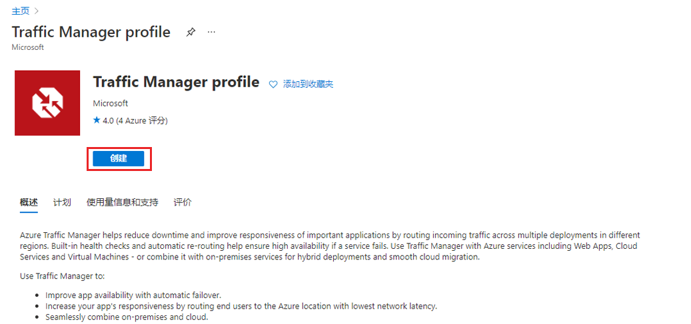
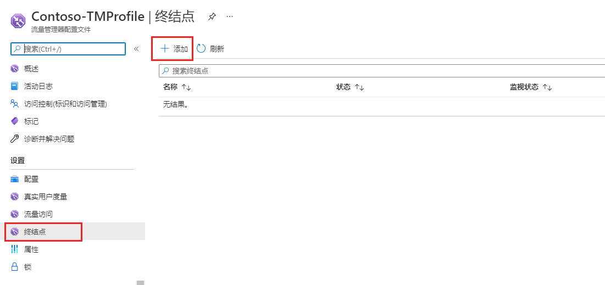
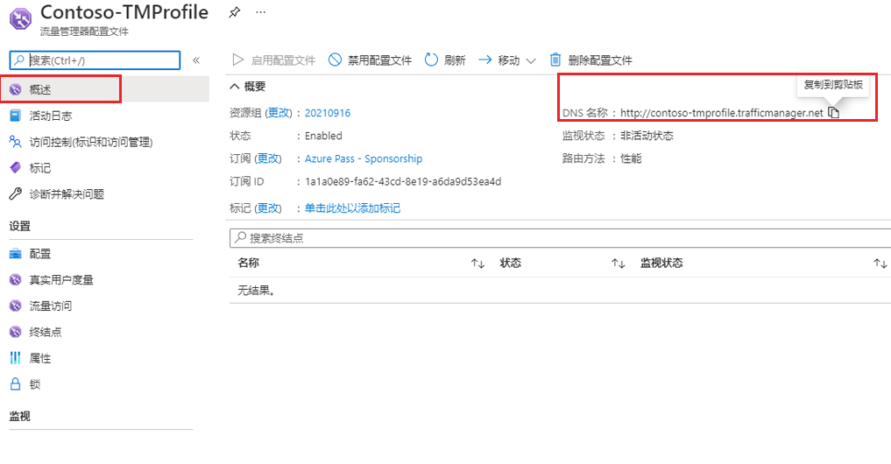
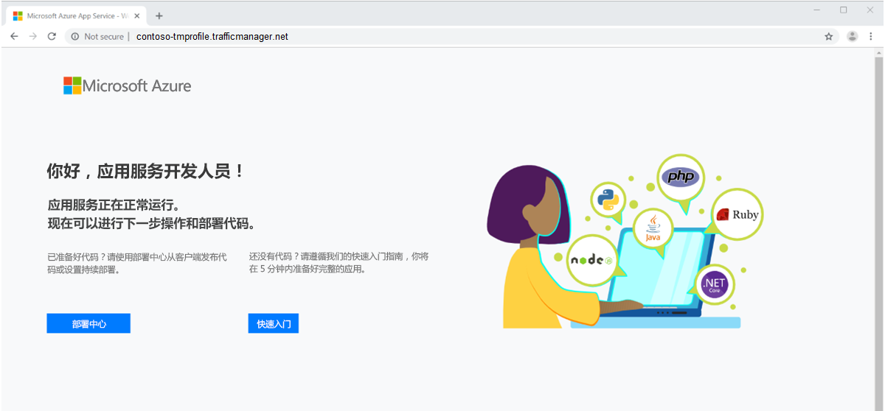
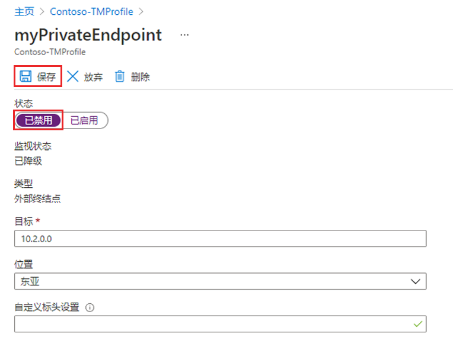

---
Exercise:
    title: '模块 04-第 6 单元 使用 Azure 门户创建流量管理器配置文件'
    module: '模块 - 在 Azure 中对非 HTTP(S) 流量进行负载均衡'
---

# 模块 04-第 6 单元 使用 Azure 门户创建流量管理器配置文件

在本练习中，你将创建流量管理器配置文件来实现虚构的 Contoso Ltd 组织的 Web 应用程序的高可用性。 

你将创建两个部署在两个不同区域（美国东部和西欧）的 Web 应用程序实例。美国东部区域充当流量管理器的主终结点，西欧区域充当故障转移终结点。

然后需根据终结点优先级创建流量管理器配置文件。此配置文件将用户流量定向到运行 Web 应用程序的主站点。流量管理器将持续监视 Web 应用程序，如果美国东部区域的主站点不可用，流量管理器会自动故障转移到西欧的备用站点。

下图大概说明了将在本练习中部署的环境。

​	

 在本练习中，你将：

+ 任务 1：创建 Web 应用
+ 任务 2：创建流量管理器配置文件
+ 任务 3：添加流量管理器终结点
+ 任务 4：测试流量管理器配置文件
+ 任务 5：清理资源


## 任务 1：创建 Web 应用

在本部分中，你将创建两个部署在两个不同 Azure 区域的 Web 应用程序实例。

1. 在 Azure 门户主页上，单击“**创建资源**”，然后选择“**Web 应用**”（如果此页中未列出此资源类型，请使用页面顶部的搜索框进行搜索，然后选择此资源类型）。

2. 在“**创建 Web 应用**”页的“**基本信息**”选项卡中，使用下表中的信息创建第一个 Web 应用程序。

   | **设置**      | **值**                                                    |
   | ---------------- | ------------------------------------------------------------ |
   | 订阅     | 选择你的订阅                                     |
   | 资源组   | 选择“**新建**”，名称： **Contoso-RG-TM1**             |
   | 名称             | **ContosoWebAppEastUS**                                      |
   | 发布          | **代码**                                                     |
   | 运行时堆栈    | **ASP.NET V4.8**                                             |
   | 操作系统 | **Windows**                                                  |
   | 区域           | **美国东部**                                                  |
   | Windows 计划     | 选择“**新建**”，名称 ：**ContosoAppServicePlanEastUS** |
   | SKU 和大小     | **标准 S1 100 总 ACU，1.75-GB 内存**               |


3. 单击“**下一步:  部署 (预览版)**”，然后单击“**下一步:  监视**”。

4. 在“**监视**”选项卡上，针对“**启用 Application Insights**”选择“**否**”选项。

5. 单击“**查看 + 创建**”。

   

6. 单击“**创建**”。Web 应用在成功部署后会创建默认的网站。

7. 重复执行上面的步骤 1-6 以创建第二个 Web 应用。除下表中的信息以外，其他都使用与之前相同的设置。 

   | **设置**    | **值**                                                    |
   | -------------- | ------------------------------------------------------------ |
   | 资源组 | 选择“**新建**”，名称： **Contoso-RG-TM2**             |
   | 名称           | **ContosoWebAppWestEurope**                                  |
   | 区域         | **西欧**                                              |
   | Windows 计划   | 选择“**新建**”，名称：**ContosoAppServicePlanWestEurope** |


8. 在 Azure 主页上，单击“**所有服务**”，在左侧导航菜单中选择“**Web**”，然后单击“**应用服务**”。

9. 应能看到列出的两个新 Web 应用。

   

 

## 任务 2：创建流量管理器配置文件

现在你将创建根据终结点优先级定向用户流量的流量管理器配置文件。

1. 在 Azure 门户主页上，单击“**创建资源**”。

2. 在页面顶部的搜索框中，键入“**流量管理器配置文件**”，然后在弹出列表中选择该项。

   

3. 单击“**创建**”。

4. 在“**创建流量管理器配置文件**”页上，使用下表中的信息创建流量管理器配置文件。

   | **设置**             | **值**                |
   | ----------------------- | ------------------------ |
   | 名称                    | **Contoso-TMProfile**    |
   | 路由方法          | **优先级**             |
   | 订阅            | 选择你的订阅 |
   | 资源组          | **Contoso-RG-TM1**       |
   | 资源组位置 | **美国东部**              |


5. 单击“**创建**”。

 

## 任务 3：添加流量管理器终结点

在本部分中，你将美国东部区域的网站添加为用于路由所有用户流量的主终结点。然后将西欧区域的网站添加为故障转移终结点。当主终结点不可用时，流量会自动路由到故障转移终结点。

1. 在 Azure 门户主页上，单击“**所有资源**”，然后单击资源列表中的“**Contoso-TMProfile**”。

2. 在“**设置**”下方，选择“**终结点**”，然后单击“**添加**”。

   

3. 在“**添加终结点**”页上，输入下表中的信息。

   | **设置**          | **值**                         |
   | -------------------- | --------------------------------- |
   | 类型                 | **Azure 终结点**                |
   | 名称                 | **myPrimaryEndpoint**             |
   | 目标资源类型 | **应用服务**                   |
   | 目标资源      | **ContosoWebAppEastUS（美国东部）** |
   | 优先级             | **1**                             |


4. 单击“**添加**”。

5. 重复执行上面的步骤 2-4 以创建故障转移终结点。除下表中的信息以外，其他都使用与之前相同的设置。 

   | **设置**     | **值**                                 |
   | --------------- | ----------------------------------------- |
   | 名称            | **myFailoverEndpoint**                    |
   | 目标资源 | **ContosoWebAppWestEurope（西欧）** |
   | 优先级        | **2**                                     |


6. 设置优先级 2 表示当配置的主终结点运行不正常时，流量会路由到此故障转移终结点。

7. 这两个新终结点在流量管理器配置文件中显示。请注意几分钟后，“**监视状态**”应会更改为“**联机**”。

   

 

## 任务 4：测试流量管理器配置文件

在本部分中，你将检查流量管理器配置文件的 DNS 名称，然后将配置主终结点，使其不可用。然后你将验证 Web 应用是否仍可用，以测试流量管理器配置文件是否成功地将流量发送到故障转移终结点。

1. 在“**Contoso-TMProfile**”页上，单击“**概述**”。

2. 在“**概述**”屏幕上，将 **DNS 名称**条目复制到剪贴板（或者将其记录在某处）。

   

3. 打开 Web 浏览器选项卡，在地址栏中粘贴（或输入）DNS 名称条目 (contoso-tmprofile.trafficmanager.net)，然后按 **Enter**。

4. 此时应会显示 Web 应用的默认网站。

   

5. 当前，由于将主终结点“**优先级**”设置为“**1**”，所有流量都发送到主终结点。

6. 若要测试故障转移终结点是否正常运行，需要禁用主站点。

7. 在“**Contoso-TMProfile**”页的“**概述**”屏幕上，选择“**myPrimaryEndpoint**”。

8. 在“**myPrimaryEndpoint**”页的“**状态**”下，单击“**已禁用**”，然后单击“**保存**”。

   

9. 关闭“**myPrimaryEndpoint**”页（单击页面右上角的“**X**”）。

10. 在“**Contoso-TMProfile**”页上，“**myPrimaryEndpoint**”的“**监视状态**”现在应为“**已禁用**”。

11. 打开新的 Web 浏览器会话，在地址栏中粘贴（或输入）**DNS 名称**条目 (contoso-tmprofile.trafficmanager.net)，然后按 Enter。

12. 验证 Web 应用是否仍然可以响应。由于主终结点不可用，流量改为路由到故障转移终结点，使网站可以继续正常运行。

 
 ## 任务 5：清理资源

   >**备注**：请记得删除不再使用的所有新创建的 Azure 资源。删除未使用的资源，确保不产生意外费用。

1. 在 Azure 门户中，在“**Cloud Shell**”窗格中打开“**PowerShell**”会话。

1. 运行以下命令，删除在本模块各个实验室中创建的所有资源组：

   ```powershell
   Remove-AzResourceGroup -Name 'NAME OF THE RG' -Force -AsJob
   ```

    >**备注**：该命令以异步方式执行（由 -AsJob 参数决定），因此，虽然你随后可在同一 PowerShell 会话中立即运行另一个 PowerShell 命令，但实际上要花几分钟才能删除资源组。
 

