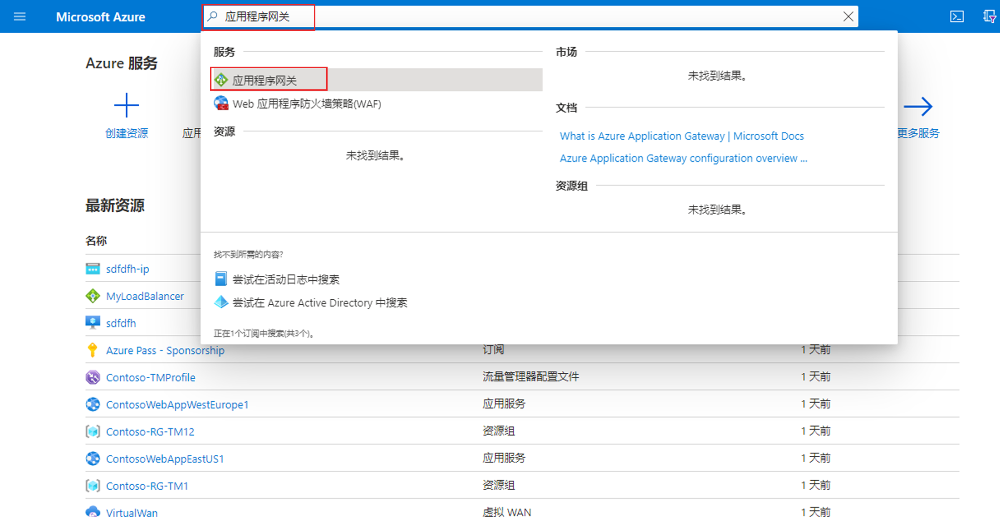
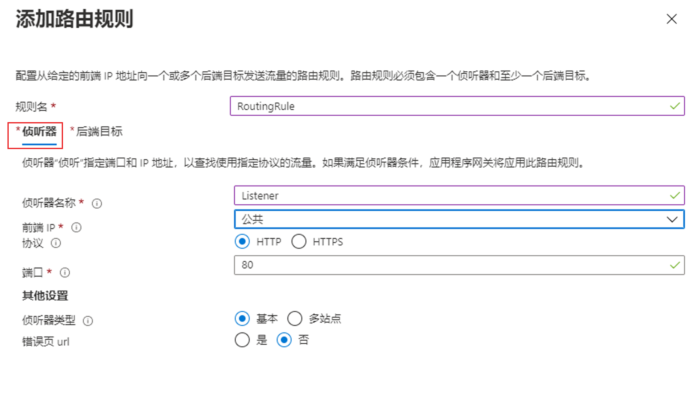
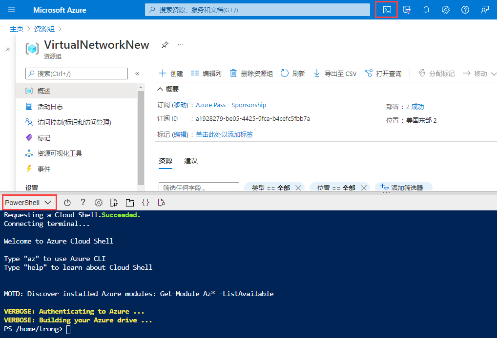
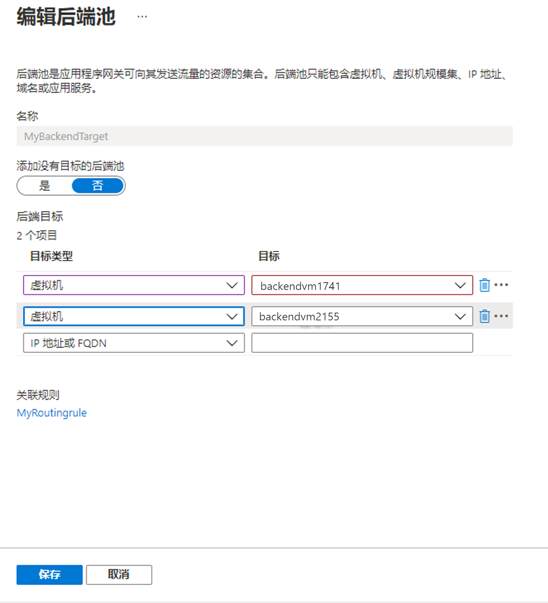
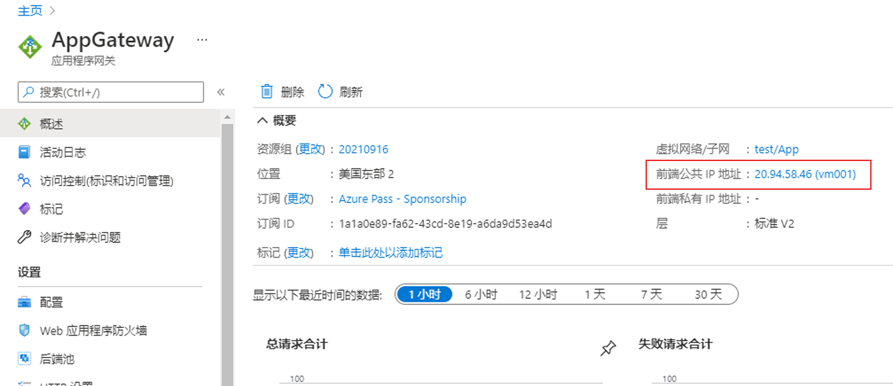

---
Exercise:
    title: '模块 05-第 4 单元 部署 Azure 应用程序网关'
    module: '模块 - 在 Azure 中对 HTTP(S) 流量进行负载均衡'
---

# 模块 05-第 4 单元 部署 Azure 应用程序网关
 

在本练习中，使用 Azure 门户创建一个应用程序网关。然后对其进行测试以确保其正常运行。

该应用程序网关将应用程序 Web 流量定向到后端池中的特定资源。你将向端口分配侦听器，创建规则，并向后端池中添加资源。为简单起见，本文使用了带有公共前端 IP 的简单设置、一个在应用程序网关上托管单个站点的基本侦听器、一个基本的请求路由规则，以及后端池中的两台虚拟机。

为了使 Azure 在你创建的资源之间进行通信，需要一个虚拟网络。可以创建新的虚拟网络或使用现有虚拟网络。在此示例中，你将在创建应用程序网关的同时创建新的虚拟网络。应用程序网关实例是在单独的子网中创建的。在此示例中，你将创建两个子网：一个用于应用程序网关，另一个用于后端服务器。

在本练习中，你将：

+ 任务 1：创建应用程序网关
+ 任务 2：添加后端目标
+ 任务 3：将后端服务器添加到后端池
+ 任务 4：测试应用程序网关


## 任务 1：创建应用程序网关

1. 使用 Azure 帐户登录到 [Azure 门户](https://portal.azure.com/)。

2. 在任意 Azure 门户页上的“**搜索资源、服务和文档 (G+/)**”中，输入“应用程序网关”，然后从结果中选择“**应用程序网关**”。
        

3. 在“应用程序网关”页上，选择“**+ 创建**”。

4. 在“创建应用程序网关”页的“**基本**”信息选项卡中，输入或选择以下信息：

   | **设置**         | **值**                                    |
   | ------------------- | -------------------------------------------- |
   | 订阅        | 选择你的订阅。                    |
   | 资源组      | 选择“创建新的 ContosoResourceGroup”       |
   | 应用程序网关 | ContosoAppGateway                            |
   | 区域              | 选择“**美国西部**”                           |
   | 虚拟网络     | 选择“**新建**”                        |

5. 在“创建虚拟网络”页中，输入或选择以下信息：

   | **设置**       | **值**                          |
   | ----------------- | ---------------------------------- |
   | 名称              | ContosoVNet                        |
   | **地址空间** |                                    |
   | 地址范围     | 10.0.0.0/16                        |
   | **子网**       |                                    |
   | 子网名称       | 将“**默认**”更改为“**AGSubnet**”|
   | 地址范围     | 10.0.0.0/24                        |
   | 子网名称       | BackendSubnet                      |
   | 地址范围     | 10.0.1.0/24                        |

6. 选择“**确定**”以返回“创建应用程序网关”页的“基本信息”选项卡。

7. 接受其他设置的默认值，然后选择“**下一步: 前端**”。

8. 在“**前端**”选项卡中，确认“**前端 IP 地址类型**”设置为“**公共**”。

9. 对于“**公共 IP 地址**”，请选择“**添加新项**”，对于“公共 IP 地址名称”，输入“AGPublicIPAddress”，然后选择“**确定**”。

10. 选择“**下一步: 后端**”。

11. 在“**后端**”选项卡上，选择“**添加后端池**”。

12. 在打开的“**添加后端池**”窗口中，输入以下值以创建一个空的后端池：

    | **设置**                      | **值**   |
    | -------------------------------- | ----------- |
    | 名称                             | BackendPool |
    | 添加不包含目标的后端池 | 是         |

13. 在“**添加后端池**”窗口中，选择“**添加**”以保存后端池配置并返回到“**后端**”选项卡。

14. 在“**后端**”选项卡中，选择“**下一步: 配置**”。

15. 在“**配置**”选项卡中，你将连接使用路由规则创建的前端池和后端池。

16. 在“**路由规则**”列中，选择“**添加路由规则**”。

17. 在“**规则名称**”框中，输入“**RoutingRule**”。

18. 在“**侦听器**”选项卡中，输入或选择以下信息：

    | **设置**   | **值**         |
    | ------------- | ----------------- |
    | 侦听器名称 | 侦听器          |
    | 前端 IP   | 选择“**公共**” |

19. 接受“**侦听器**”选项卡上的其他设置的默认值=。

    

20. 选择“**后端目标**”选项卡来配置剩下的路由规则。

21. 在“**后端目标**”选项卡中，输入或选择以下信息：

    | **设置**   | **值**      |
    | ------------- | -------------- |
    | 目标类型   | 后端池   |
    | HTTP 设置 | **新建** |

22. 在“**添加 HTTP 设置**”中，输入或选择以下信息：

    | **设置**        | **值**   |
    | ------------------ | ----------- |
    | HTTP 设置名称 | HTTPSetting |
    | 后端端口       | 80          |

23. 在“**添加 HTTP 设置**”窗口中接受其他默认设置，然后选择“**添加**”，返回到“**添加路由规则**”。

24. 选择“**添加**”保存路由规则并返回“**配置**”选项卡。

25. 选择“**下一步: 标记**”，然后选择“**下一步: 查看 + 创建**”。

26. 查看“**查看 + 创建**”选项卡上的设置

27. 选择“**创建**”来创建虚拟网络、公共 IP 地址和应用程序网关。 

Azure 创建应用程序网关可能需要几分钟。请等待部署成功完成，然后再前进到下一部分。

## 任务 2：添加后端目标

本示例将使用虚拟机作为目标后端。我们将创建两个虚拟机，用作应用程序网关的后端服务器。

为此，将要：

- 创建两个新的 VM（BackendVM1 和 BackendVM2），用作后端服务器。

- 可以在虚拟机上安装 IIS，以验证是否已成功创建了应用程序网关。

- 将后端服务器添加到后端池。

### 创建虚拟机

1. 在任意 Azure 门户页上的“**搜索资源、服务和文档 (G+/)**”中，输入“虚拟机”，然后从结果中选择“**虚拟机**”。 

2. 在“虚拟机”页上，选择“**+ 创建**” > “**+ 虚拟机**”。

3. 在“**创建虚拟机**”页中，输入或选择以下信息（如果未列出设置，请使用默认值）：

   | **设置**          | **值**                                        |
   | -------------------- | ------------------------------------------------ |
   | “**基本信息**”选项卡       |                                                  |
   | 订阅         | 选择你的订阅。                        |
   | 资源组       | 选择 ContosoResourceGroup                      |
   | 虚拟机名称 | 中的机器人 BackendVM1                                       |
   | 映像                | 选择“**Windows Server 2016 Datacenter - Gen1**”|
   | 用户名             | TestUser                                         |
   | 密码             | TestPa$$w0rd                                     |
   | 公共入站端口 | 无                                             |
   | **网络**       |                                                  |
   | 虚拟网络      | ContosoVnet                                      |
   | 子网               | BackendSubnet (10.0.1.0/24)                      |
   | **管理**       |                                                  |
   | 启动诊断     | 禁用                                          |

4. 接受其他默认值，然后选择“**查看 + 创建**”。

5. 在“**查看 + 创建**”选项卡上查看设置，更正任何验证错误，然后选择“**创建**”。

等待虚拟机创建完成，然后再继续操作。

### 安装 IIS 进行测试

本示例在虚拟机上安装 IIS，以验证 Azure 是否已成功创建应用程序网关。

1. 打开 Azure PowerShell。

2. 在 Azure 门户的顶部导航栏中选择“**Cloud Shell**”，然后从下拉列表中选择“**PowerShell**”。

   

3. 运行以下命令以在虚拟机上安装 IIS。如有必要，请更改 Location 参数：

```Azure PowerShell
Set-AzVMExtension `

 -ResourceGroupName ContosoResourceGroup `

 -ExtensionName IIS `

 -VMName BackendVM1 `

 -Publisher Microsoft.Compute `

 -ExtensionType CustomScriptExtension `

 -TypeHandlerVersion 1.4 `

 -SettingString '{"commandToExecute":"powershell Add-WindowsFeature Web-Server; powershell Add-Content -Path \"C:\\inetpub\\wwwroot\\Default.htm\" -Value $($env:computername)"}' `

 -Location WestUS
```

4. 使用前面完成的“创建虚拟机”和“安装 IIS 进行测试”中的步骤创建第二个虚拟机并安装 IIS。使用 BackendVM2 作为虚拟机名称，以及作为 **Set-AzVMExtension** cmdlet 的 **VMName** 设置。

## 任务 3：将后端服务器添加到后端池

1. 在 Azure 门户菜单上，选择“所有资源”，或搜索并选择“**所有资源**”。然后选择“**ContosoAppGateway**”。

2. 在“**设置**”下，选择“**后端池**”。

3. 选择“**BackendPool**”。

4. 在“**编辑后端池**”页的“**后端目标**”下，在“**目标类型**”中选择“**虚拟机**”。

5. 在“**目标**”下，选择“**BackendVM1**”。 

6. 在“**目标类型**”中选择“**虚拟机**”。

7. 在“**目标**”下，选择“**BackendVM2**”。 

   

8. 选择“**保存**”。

请等待部署完成之后再继续下一步。

## 任务 4：测试应用程序网关

虽然无需 IIS 即可创建应用程序网关，但本练习中安装了它，用来验证 Azure 是否已成功创建应用程序网关。

### 使用 IIS 测试应用程序网关：

1. 在“**概述**”页上找到应用程序网关的公共 IP 地址。 

   

2. 复制公共 IP 地址，然后将其粘贴到浏览器的地址栏中，以便浏览该 IP 地址。

3. 检查响应。有效响应验证应用程序网关是否已成功创建，以及是否能够成功连接后端。

   

4. 多次刷新浏览器就会看到与 BackendVM1 和 BackendVM2 的连接。

恭喜！你已配置并测试了 Azure 应用程序网关。
