---
Exercise:
    title: '模块 06-单元 7 使用 Azure 门户部署和配置 Azure 防火墙'
    module: '模块 - 设计和实现网络安全'
---

# 模块 06-单元 7 使用 Azure 门户部署和配置 Azure 防火墙

作为 Contoso 网络安全团队的一员，你的下一个任务是创建防火墙规则以允许/拒绝对某些网站的访问。以下步骤将指导你创建资源组、虚拟网络和子网以及虚拟机作为环境准备任务，然后部署防火墙和防火墙策略，配置默认路由和应用程序、网络和 DNAT 规则，最后测试防火墙。

在本练习中，你将：

+ 任务 1：创建资源组
+ 任务 2：创建虚拟网络和子网
+ 任务 3：创建虚拟机
+ 任务 4：部署防火墙和防火墙策略
+ 任务 5：创建默认路由
+ 任务 6：配置应用程序规则
+ 任务 7：配置网络规则
+ 任务 8：配置目标 NAT (DNAT) 规则
+ 任务 9：更改服务器网络接口的主要和次要 DNS 地址
+ 任务 10：测试防火墙

## 任务 1：创建资源组

在此任务中，你将创建新的资源组。

1. 登录到 Azure 帐户。

2. 在 Azure 门户主页上，选择“**资源组**”。

3. 单击“**创建**”。 

4. 在“**基本信息**”选项卡上的“**资源组**”中，输入 **Test-FW-RG**。

5. 在“**区域**”中，从列表中选择你所在的区域。

   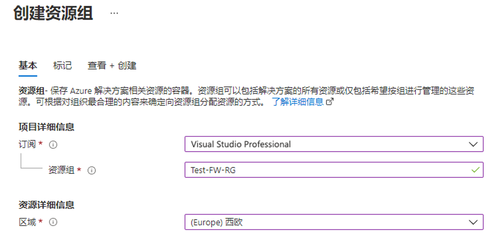

6. 单击“**查看 + 创建**”。

7. 单击“**创建**”。

 

## 任务 2：创建虚拟网络和子网

在此任务中，你将创建一个包含两个子网的虚拟网络。

1. 在 Azure 门户主页上，选择“**创建资源**”，然后在搜索框中键入“**虚拟网络**”，然后单击出现的“**虚拟网络**”。

2. 单击“**创建**”。

3. 选择之前创建的“**Test-FW-RG**”资源组。

4. 在“**名称**”框中，输入 **Test-FW-VN**。

   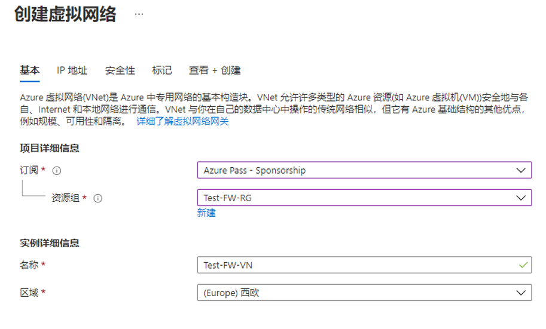

5. 单击“**下一步: IP 地址**”。

6. 在“**子网名称**”下，单击“**默认**”。

7. 在“**编辑子网**”对话框中，将名称更改为 **AzureFirewallSubnet**。

8. 将“**子网地址范围**”更改为“**10.0.1.0/26**”。

9. 单击“**保存**”。

   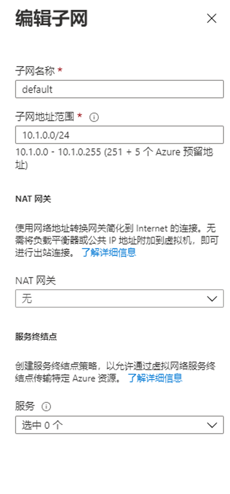

10. 单击“**添加子网**”，创建另一个子网，该子网将托管即将创建的工作负载服务器。

11. 在“**编辑子网**”对话框中，将名称更改为 **Workload-SN**。

12. 将“**子网地址范围**”更改为“**10.0.2.0/24**”。

13. 单击“**添加**”。

    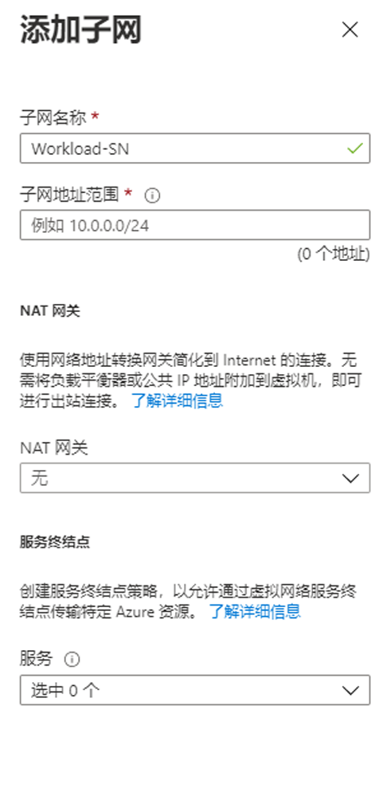

14. 单击“**查看 + 创建**”。

15. 单击“**创建**”。

 

## 任务 3：创建虚拟机

在此任务中，你将创建工作负载虚拟机，并将其置于之前创建的“Workload-SN”子网中。

1. 在 Azure 门户主页上，选择“**创建资源**”，然后在搜索框中键入“**虚拟机**”，然后选择出现的“**虚拟机**”。

2. 在“**虚拟机**”页面上，单击“**创建**”。

3. 在“**基本**”信息选项卡上，使用下表中的信息创建新 VM。

   | **设置**          | **值**                                                    |
   | -------------------- | ------------------------------------------------------------ |
   | 订阅         | 选择你的订阅                                     |
   | 资源组       | **Test-FW-RG**                                               |
   | 虚拟机名称 | **Srv-Work**                                                 |
   | 区域               | 你所在的区域                                                  |
   | 可用性选项 | **无需基础结构冗余**                    |
   | 映像                | **Windows Server 2016 Datacenter - Gen 1**                   |
   | 大小                 | 选择“**查看所有大小**”，然后在列表中选择“**B1s**”，并选择“**选择**”  **（标准_B1s - 1 个 vcpu，1 GiB 内存（8.60 英镑/月））** |
   | 用户名             | **MyAdmin**                                                  |
   | 密码             | **TestPa$$w0rd!**                                            |
   | 确认密码     | **TestPa$$w0rd!**                                            |
   | 公共入站端口 | 选择“**无**”                                             |

   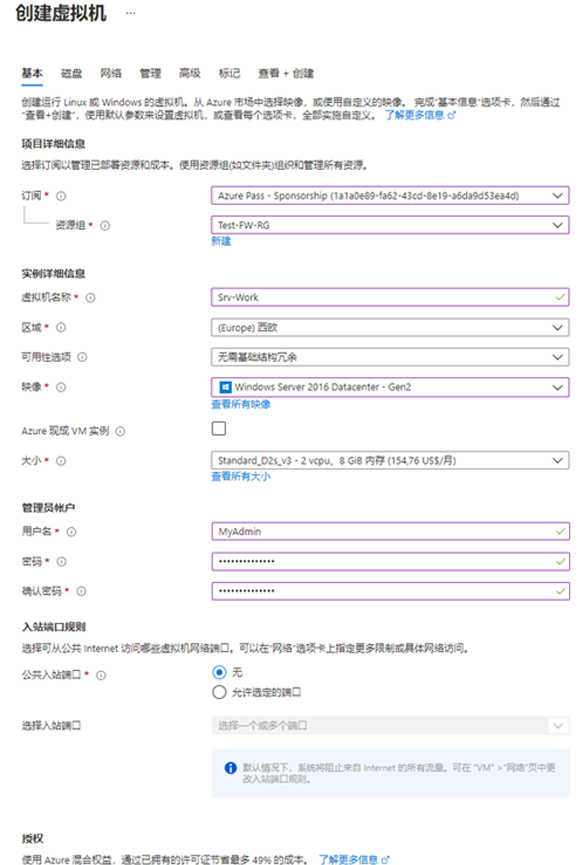

4. 单击“**下一步: 磁盘**”。

5. 单击“**下一步: 网络**”。

6. 确保选择“**Test-FW-VN**”用于虚拟网络，且子网是“**Workload-SN**”。

7. 对于“**公共 IP**”，请选择“**无**”。

8. 单击“**下一步: 管理**”。

9. 在“**监视**”下，将“**启动诊断**”设置为“**禁用**”。

10. 单击“**查看 + 创建**”。

11. 单击“**创建**”。

12. VM 部署完成后，单击“**前往资源**”。

13. 在 **Srv-Work** “**概览**”页面右侧的“**网络**”下，记下此 VM 的“**专用 IP 地址**”（例如 **10.0.2.4**）。

 

## 任务 4：部署防火墙和防火墙策略

在此任务中，你将在配置了防火墙策略的情况下，将防火墙部署到虚拟网络中。

1. 在 Azure 门户主页上，选择“**创建资源**”，然后在搜索框中键入“**防火墙**”，然后选择出现的“**防火墙**”。

2. 在“**防火墙**”页面，单击“**创建**”。

3. 在“**基本信息**”选项卡上，使用下表中的信息创建防火墙。

   | **设置**          | **值**                                                    |
   | -------------------- | ------------------------------------------------------------ |
   | 订阅         | 选择你的订阅                                     |
   | 资源组       | **Test-FW-RG**                                               |
   | 虚拟机名称 | **Test-FW01**                                                |
   | 区域               | 你所在的区域                                                  |
   | 防火墙层        | **标准**                                                 |
   | 防火墙管理  | **使用防火墙策略来管理此防火墙**            |
   | 防火墙策略      | 选择“**新增**” 名称：**fw-test-pol** 区域： **你所在的区域** |

   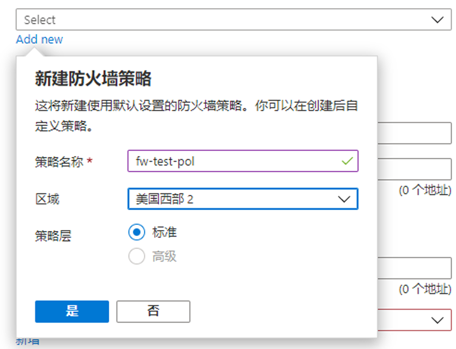

   | 选择虚拟网络 | **使用现有虚拟网络**                         |
   | ------------------------ | ---------------------------------------- |
   | 虚拟网络          | **Test-FW-VN**                           |
   | 公共 IP 地址        | 选择“**新增**” 名称： **fw-pip** |

   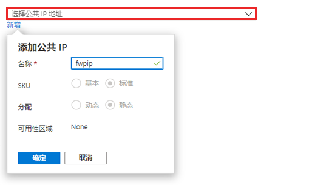

4. 查看所有设置以确保其与下面的屏幕截图相符。

   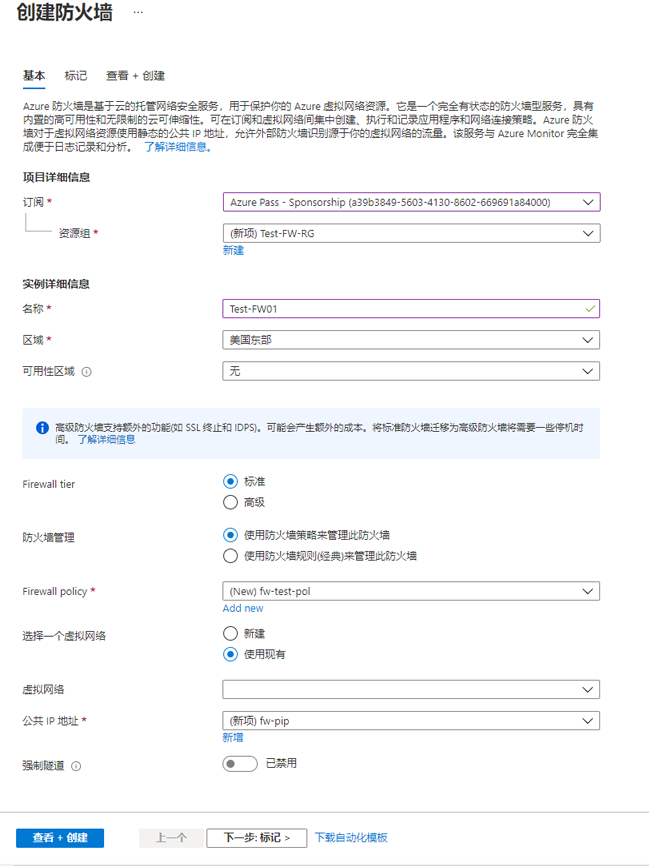

5. 单击“**查看 + 创建**”。

6. 单击“**创建**”并等待防火墙部署完成。

7. 防火墙部署完成后，单击“**前往资源**”。

8. 在 **Test-FW01** “**概览**”页面右侧，记下此防火墙的“**防火墙专用 IP**”（例如 **10.0.1.4**）。

9. 在左侧菜单中的“**设置**”下，单击“**公共 IP 配置**”。

10. 记下 **fw-pip** 公共 IP 配置的“**IP 地址**”下的地址（例如 **20.90.136.51**）。

 

## 任务 5：创建默认路由

在此任务中，你将在 Workload-SN 子网上将出站默认路由配置为通过防火墙。

1. 在 Azure 门户主页上，选择“**创建资源**”，然后在搜索框中键入“**路由**”并选择出现的“**路由表**”。

2. 在“**路由表**”页面上，单击“**创建**”。

3. 在“**基本信息**”选项卡上，使用下表中的信息创建新路由表。

   | **设置**              | **值**                |
   | ------------------------ | ------------------------ |
   | 订阅             | 选择你的订阅 |
   | 资源组           | **Test-FW-RG**           |
   | 区域                   | 你所在的区域              |
   | 名称                     | **Firewall-route**       |
   | 传播网关路由 | **是**                  |

4. 单击“**查看 + 创建**”。

5. 单击“**创建**”。

   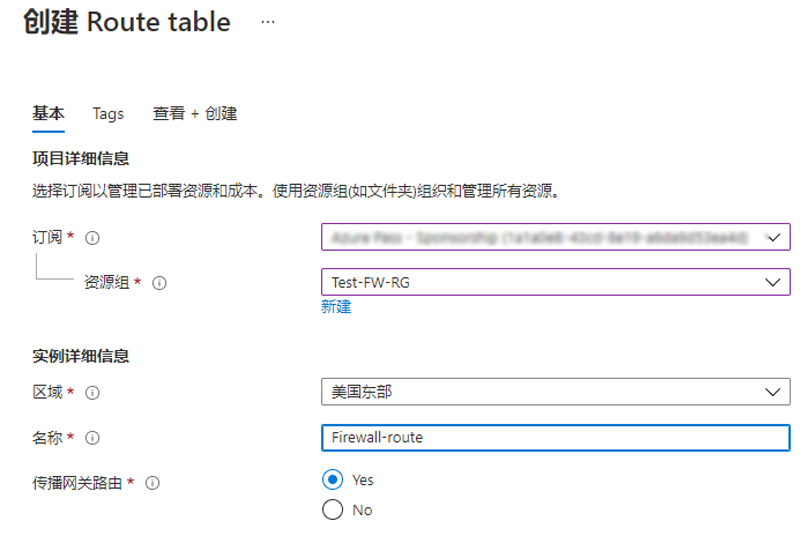

6. 部署完成后，选择“**前往资源**”。

7. 在“**Firewall-route**”页面的“**设置**”下，单击“**子网**”，再单击“**关联**”。

8. 在“**虚拟网络**”中，选择“**Test-FW-VN**”。

9. 在“**子网**”中，选择“**Workload-SN**”。确保仅为此路由选择 Workload-SN 子网，否则防火墙将无法正常工作。

10. 单击“**确定**”。

11. 在“**设置**”下，选择“**路由**”，然后单击“**添加**”。

12. 在“**路由名称**”中，输入 **fw-dg**。

13. 在“**地址前缀**”中，输入 **0.0.0.0/0**。

14. 在“**下一跃点类型**”中，选择“**虚拟设备**”。

15. 在“**下一跃点地址**”中，键入之前记下的防火墙专用 IP 地址（例如 **10.0.1.4**）

16. 单击“**确定**”。

    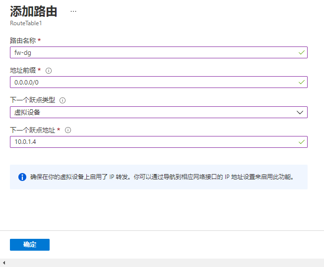

 

## 任务 6：配置应用程序规则

在此任务中，你将添加一个应用程序规则，允许出站访问 www.google.com。

1. 在 Azure 门户主页上，选择“**所有资源**”。

2. 在资源列表中，单击你的防火墙策略“**fw-test-pol**”。

3. 在“**设置**”下，单击“**应用程序规则**”。

4. 单击“**添加规则集合**”。

5. 在“**添加规则集合**”页面上，使用下表中的信息创建新应用程序规则。

   | **设置**            | **值**                                 |
   | ---------------------- | ----------------------------------------- |
   | 名称                   | **App-Coll01**                            |
   | 规则集合类型   | **应用程序**                           |
   | 优先级               | **200**                                   |
   | 规则集合操作 | **允许**                                 |
   | 规则集合组  | **DefaultApplicationRuleCollectionGroup** |
   | **规则部分**      |                                           |
   | 名称                   | **Allow-Google**                          |
   | 源类型            | **IP 地址**                            |
   | 源                 | **10.0.2.0/24**                           |
   | 协议               | **http、https**                            |
   | 目标类型       | **FQDN**                                  |
   | 目标            | **www.google.com**                        |

   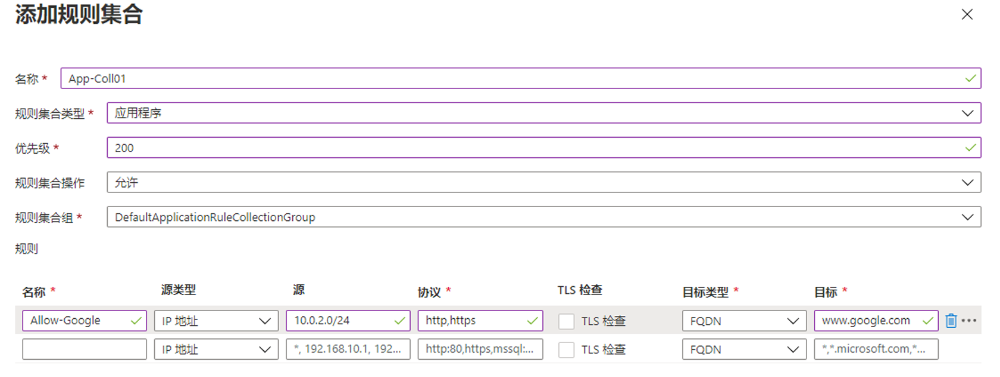

6. 单击“**添加**”。

 

## 任务 7：配置网络规则

在此任务中，你将添加一个网络规则，允许出站访问端口 53 (DNS) 上的两个 IP 地址。

1. 在“**fw-test-pol**”页面的“**设置**”下，单击“**网络规则**”。

2. 单击“**添加规则集合**”。

3. 在“**添加规则集合**”页面上，使用下表中的信息创建新网络规则。

   | **设置**            | **值**                                                    |
   | ---------------------- | ------------------------------------------------------------ |
   | 名称                   | **Net-Coll01**                                               |
   | 规则集合类型   | **网络**                                                  |
   | 优先级               | **200**                                                      |
   | 规则集合操作 | **允许**                                                    |
   | 规则集合组  | **DefaultNetworkRuleCollectionGroup**                        |
   | **规则部分**      |                                                              |
   | 名称                   | **Allow-DNS**                                                |
   | 源类型            | **IP 地址**                                               |
   | 源                 | **10.0.2.0/24**                                              |
   | 协议               | **UDP**                                                      |
   | 目标端口      | **53**                                                       |
   | 目标类型       | **IP 地址**                                               |
   | 目标            | “**209.244.0.3, 209.244.0.4**” 这些是由 Century Link 运营的公共 DNS 服务器 |

   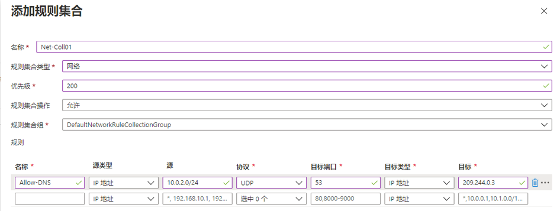

4. 单击“**添加**”。

 

## 任务 8：配置目标 NAT (DNAT) 规则

在此任务中，你将添加 DNAT 规则，允许通过防火墙将远程桌面连接到 Srv-Work 虚拟机。

1. 在“**fw-test-pol**”页面上的“**设置**”下，单击“**DNAT 规则**”。

2. 单击“**添加规则集合**”。

3. 在“**添加规则集合**”页面上，使用下表中的信息创建新 DNAT 规则。

   | **设置**           | **值**                                                    |
   | --------------------- | ------------------------------------------------------------ |
   | 名称                  | **rdp**                                                      |
   | 规则集合类型  | **DNAT**                                                     |
   | 优先级              | **200**                                                      |
   | 规则集合组 | **DefaultDnatRuleCollectionGroup**                           |
   | **规则部分**     |                                                              |
   | 名称                  | **rdp-nat**                                                  |
   | 源类型           | **IP 地址**                                               |
   | 源                | *                                                         |
   | 协议              | **TCP**                                                      |
   | 目标端口     | **3389**                                                     |
   | 目标类型      | **IP 地址**                                               |
   | 目标           | 输入之前记下的“**fw-pip**”中的防火墙公共 IP 地址。 **例如 - 20.90.136.51** |
   | 已转换的地址    | 输入之前记下的“**Srv-Work**”中的专用 IP 地址。 **例如 - 10.0.2.4** |
   | 已转换的端口       | **3389**                                                     |

​		

4. 单击“**添加**”。

 

## 任务 9：更改服务器网络接口的主要和次要 DNS 地址

出于本练习中的测试目的，你将配置 Srv-Work 服务器的主要和次要 DNS 地址。但是，这不是一项常规的 Azure 防火墙要求。

1. 在 Azure 门户主页上，选择“**资源组**”。

2. 在资源组列表中，单击你的资源组“**Test-FW-RG**”。

3. 在此资源组的资源列表中，选择 **Srv-Work** 虚拟机的网络接口（例如 **srv-work350**）。

   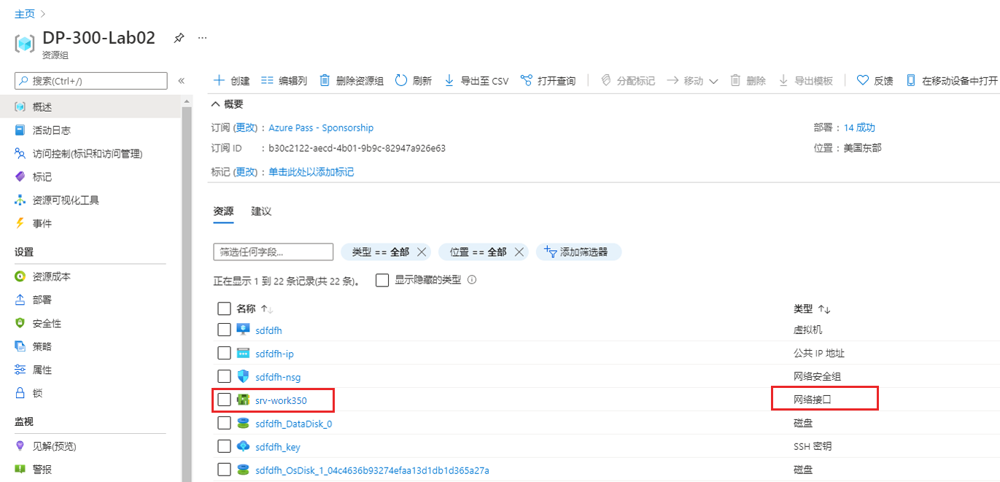

4. 在“**设置**”下，选择“**DNS 服务器**”。

5. 在“**DNS 服务器**”下，选择“**自定义**”。

6. 在 **添加 DNS 服务器**文本框中，输入 **209.244.0.3**，以及在下一个文本框中输入 **209.244.0.4**。

7. 选择**保存**。

   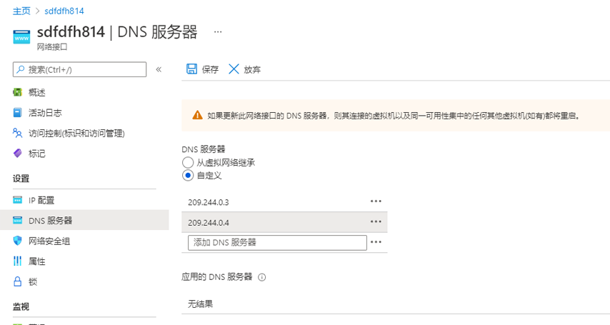

8. 重启 **Srv-Work** 虚拟机。

 

## 任务 10：测试防火墙

在这个最后的任务中，你将测试防火墙，以验证规则是否配置正确并按预期运行。使用此配置，可以通过防火墙的公共 IP 地址将远程桌面连接连接到 Srv-Work 虚拟机。

1. 在你的电脑上打开“**远程桌面连接**”。

2. 在“**计算机**”框中，输入防火墙的公共 IP 地址（例如 **20.90.136.51**），后跟 **:3389**（例如 **20.90.136.51:3389**）。

3. 在“**用户名**”框中，输入 **MyAdmin**。

4. 单击“**连接**”。

   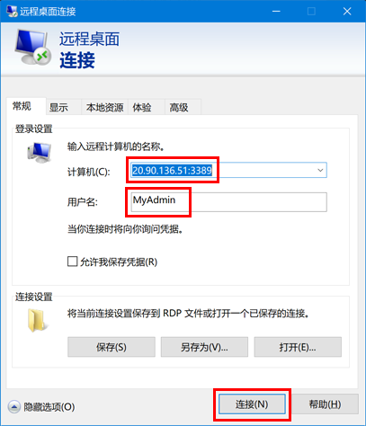

5. 在“**输入凭据**”对话框中，使用密码 **TestPa$$w0rd!** 登录 **Srv-Work** 服务器虚拟机。

6. 单击“**确定**”。

7. 在证书消息上单击“**是**”。

8. 打开 Internet Explorer 并浏览到 **https://www.google.com** 。

9. 在“**安全警报**”对话框中，单击“**确定**”。

10. 在可能弹出的 Internet Explorer 安全警报上单击“**关闭**”。

11. 你应该会看到 Google 主页。

    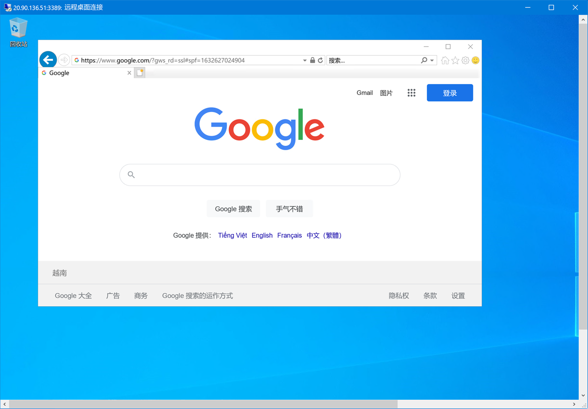

12. 浏览到 **https://www.microsoft.com** 。

13. 你应该会受到防火墙阻止。

    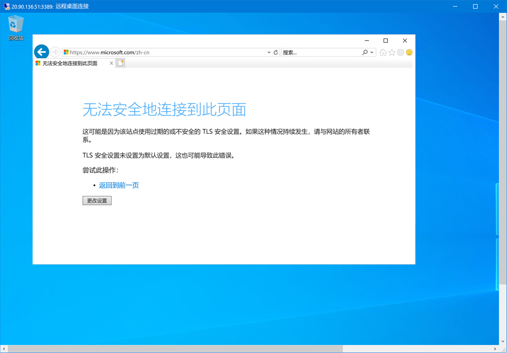

 
