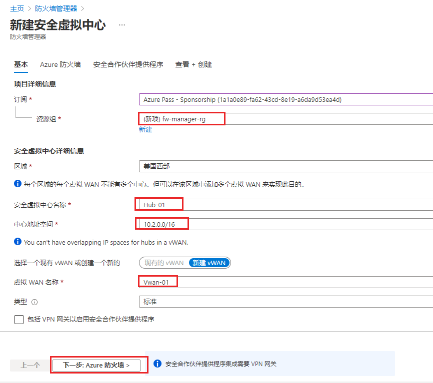
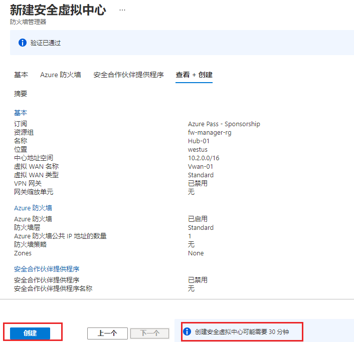
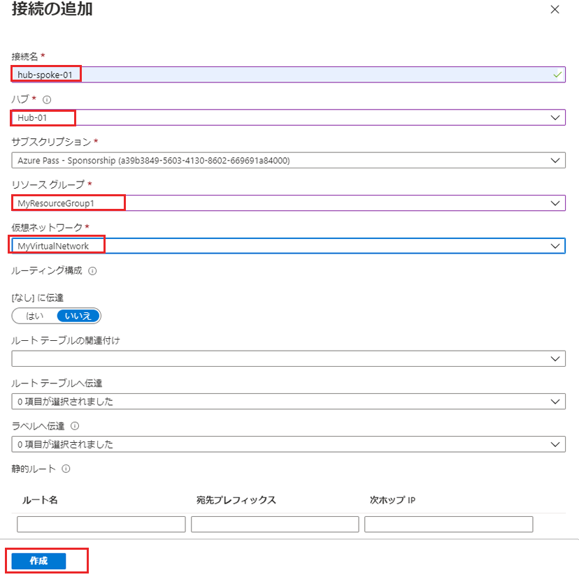
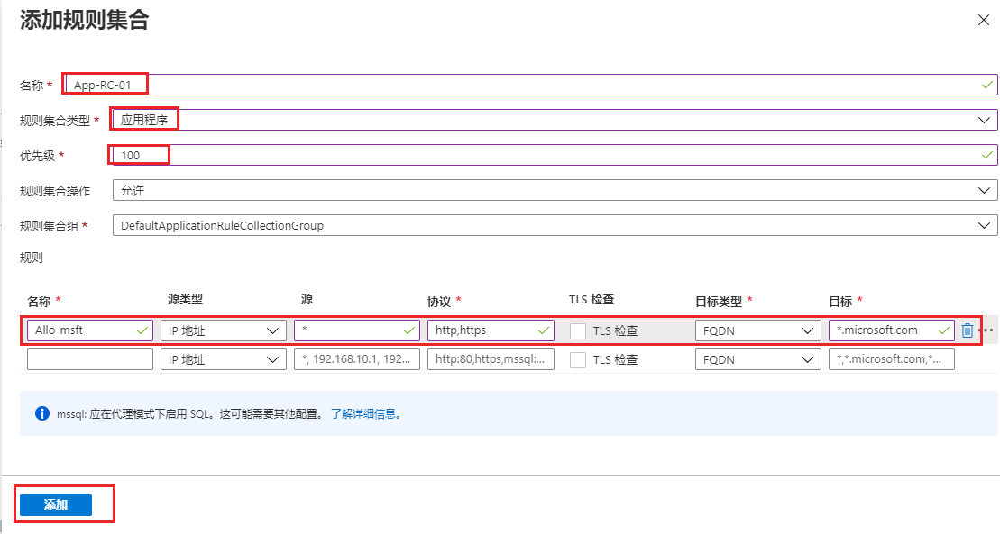
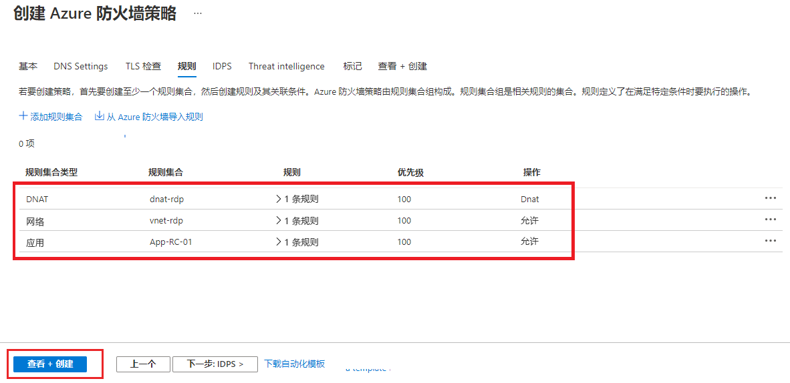
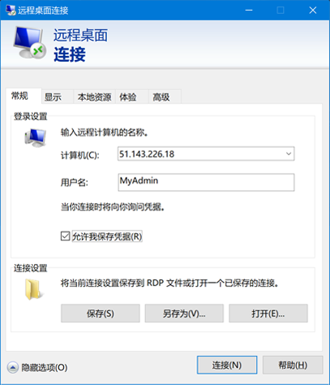
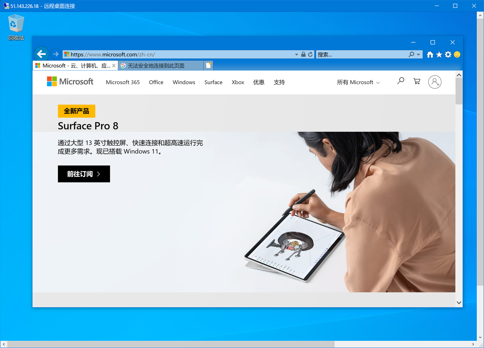
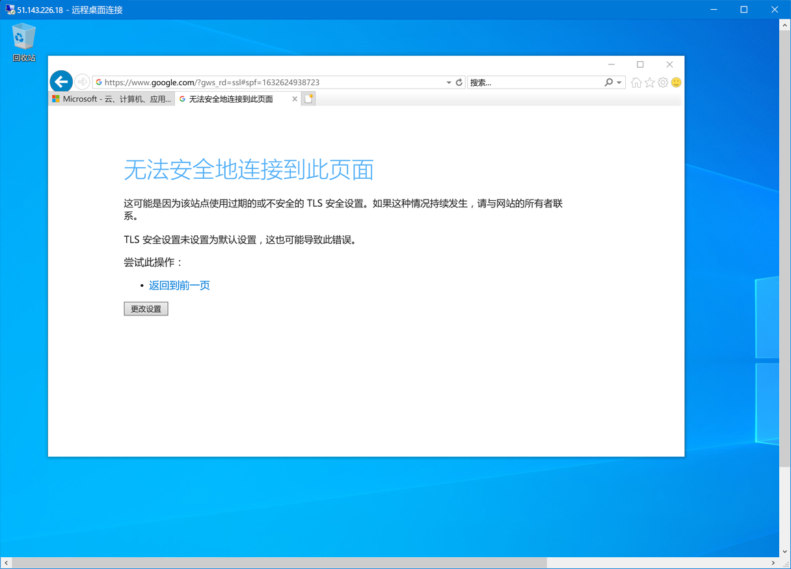
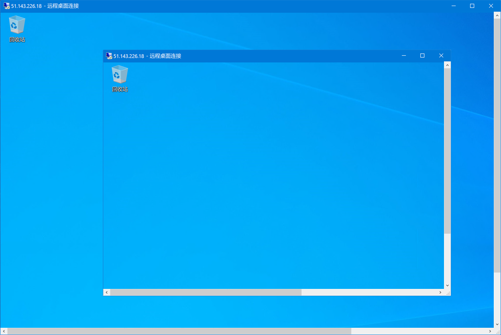

---
Exercise:
    title: '模块 06-单元 9 使用 Azure 防火墙管理器保护虚拟中心安全'
    module: '模块 - 设计和实现网络安全'
---


# 模块 06-单元 9 使用 Azure 防火墙管理器保护虚拟中心安全

在本练习中，你将创建辐射型虚拟网络以及一个安全虚拟中心，然后你将连接中心辐射型虚拟网络，并将流量路由到中心。接下来，你将部署工作负载服务器，然后创建防火墙策略并保护中心，最后将测试防火墙。

## 创建中心辐射型体系结构

在此部分练习中，你将创建辐射型虚拟网络和子网，并在其中放置工作负载服务器。然后，你将创建安全虚拟中心并连接中心辐射型虚拟网络。

在本练习中，你将：

+ 任务 1：创建两个辐射型虚拟网络和子网
+ 任务 2：创建安全虚拟中心
+ 任务 3：连接中心辐射型虚拟网络
+ 任务 4：部署服务器
+ 任务 5：创建防火墙策略并保护中心
+ 任务 6：关联防火墙策略
+ 任务 7：将流量路由到中心
+ 任务 8：测试应用程序规则
+ 任务 9：测试网络规则
+ 任务 10：清理资源

## 任务 1：创建两个辐射型虚拟网络和子网

在此任务中，你将创建两个辐射型虚拟网络，其中每个网络都包含一个将托管工作负载服务器的子网。 

1. 在 Azure 门户主页上，选择“**创建资源**”，然后在搜索框中键入“**虚拟网络**”，然后单击出现的“**虚拟网络**”。
2. 单击“**创建**”。
3. 在“**资源组**”中，选择“**新建**”，输入 **fw-manager-rg** 作为名称，然后单击“**确定**”。
4. 在“**名称**”中，输入 **Spoke-01**。
5. 在“**区域**”中，选择你所在的区域。
6. 单击“**下一步: IP 地址**”。
7. 在“**IPv4 地址空间**”中，输入 **10.0.0.0/16**。 
8. **删除**此处列出的任何其他地址空间，例如 **10.1.0.0/16**。
9. 在“**子网名称**”下，单击“**默认**”。
10. 在“**编辑子网**”对话框中，将名称更改为 **Workload-01-SN**。
11. 将“**子网地址范围**”更改为“**10.0.1.0/24**”。
12. 单击“**保存**”。
13. 单击“**查看 + 创建**”。
14. 单击“**创建**”。

重复上面的步骤 1 到 14，以创建另一个类似的虚拟网络和子网，但使用以下信息：

- 资源组：**fw-manager-rg**（选择现有资源组）
- 名称：**Spoke-02**
- 地址空间：**10.1.0.0/16** - （删除列出的任何其他地址空间）
- 子网名称：**Workload-02-SN**
- 子网地址范围：**10.1.1.0/24**

## 任务 2：创建安全虚拟中心

在此任务中，你将使用防火墙管理器创建安全虚拟中心。

1. 从 Azure 门户主页中，单击“**所有服务**”。

2. 在搜索框中，键入“**防火墙管理器**”，并选择出现的“**防火墙管理器**”。

3. 在“**防火墙管理器**”页上，单击“**查看安全虚拟中心**”。

4. 在“**虚拟中心**”页上，单击“**创建新的安全虚拟中心**”。

5. 对于“**资源组**”，选择“**fw-manager-rg**”。

6. 在“**区域**”中，选择你所在的区域。

7. 在“**安全虚拟中心名称**”中，输入 **Hub-01**。

8. 在“**中心地址空间**”中，输入 **10.2.0.0/16**。

9. 选择“**新建 vWAN**”。

10. 在“**虚拟 WAN 名称**”中，输入 **Vwan-01**。

11. 单击“**下一步: Azure 防火墙**”。
    

12. 单击“**下一步: 安全合作伙伴提供程序**”。

13. 单击“**下一步: 查看 + 创建**”。

14. 单击“**创建**”。

    > **[!备注]** 
    >
    > 此步骤最多可能需要 30 分钟才能完成。

    ​

    

15. 部署完成后，从 Azure 门户主页中，单击“**所有服务**”。

16. 在搜索框中，键入“**防火墙管理器**”，并选择出现的“**防火墙管理器**”。

17. 在“**防火墙管理器**”页上，单击“**虚拟中心**”。

18. 单击“**Hub-01**”。

19. 单击“**公共 IP 配置**”。

20. 记下公共 IP 地址（例如 51.143.226.18），稍后你将使用该地址。

## 任务 3：连接中心辐射型虚拟网络

在此任务中，你将连接中心辐射型虚拟网络。这通常称为对等互连。

1. 从 Azure 门户主页中，单击“**资源组**”。
2. 选择“**fw-manager-rg**”资源组，然后选择“**Vwan-01**”虚拟 WAN。
3. 在“**连接**”下，单击“**虚拟网络连接**”。
4. 单击“**添加连接**”。
5. 对于“**连接名称**”，输入 **hub-spoke-01**。
6. 对于“**中心**”，选择“**Hub-01**”。
7. 对于“**资源组**”，选择“**fw-manager-rg**”。
8. 对于“**虚拟网络**”，选择“**Spoke-01**”。
9. 单击“**创建**”。
   
10. 重复上面的步骤 4 到 9，以创建另一个类似的连接，但使用连接名称 **hub-spoke-02** 来连接 **Spoke-02** 虚拟网络。


 

## 任务 4：部署服务器

在此任务中，你将部署两个工作负载服务器。

1. 在 Azure 门户主页上，单击“**创建资源**”。

2. 在“热门产品/服务”列表中，选择“**Windows Server Datacenter 2019**”。

3. 在“**创建虚拟机**”页面的“**基本信息**”选项卡上，使用下表中的信息创建新的 VM。

   | **设置**          | **值**                |
   | -------------------- | ------------------------ |
   | 订阅         | 选择你的订阅 |
   | 资源组       | **fw-manager-rg**        |
   | 虚拟机名称 | **Srv-workload-01**      |
   | 区域               | 你所在的区域              |
   | 用户名             | **MyAdmin**              |
   | 密码             | **TestPa$$w0rd!**        |
   | 确认密码     | **TestPa$$w0rd!**        |
   | 公共入站端口 | **无**                 |

4. 单击“**下一步: 磁盘”**。

5. 单击“**下一步:  网络”**。

6. 在“**虚拟网络**”中，确保选中“**Spoke-01**”。

7. 在“**子网**”中，确保选中“**Workload-01-SN**”。 

8. 在“**公共 IP**”中，选择“**无**”。

9. 单击“**下一步: 管理**”。

10. 在“**监视**”下的“**启动诊断**”中，单击“**禁用**”。

11. 单击“**查看 + 创建**”。

12. 单击“**创建**”。

13. 此部署完成后，单击“**创建另一个 VM**”。

14. 重复上面的步骤 **3 到 12**，以创建另一个虚拟机，但使用以下信息：

    - 虚拟机名称：**Srv-workload-02**
    - 虚拟网络：**Spoke-02**
    - 子网：**Workload-02-SN**
    - 公共 IP：**无**

15. 第二个 VM 部署完成后，单击“**前往资源**”。

16. 在 **Srv-workload-02** 的“**概览**”页面的右侧窗格中，记下“**网络**”部分下的**专用 IP 地址**（例如，**10.1.1.4**）。

17. 单击“**主页**”。

18. 在 Azure 门户主页上，单击“**所有资源**”。

19. 单击“**Srv-workload-01**”虚拟机。

20. 在 **Srv-workload-01** 的“**概览**”页面的右侧窗格中，记下“**网络**”部分下的**专用 IP 地址**（例如，**10.0.1.4**）。


## 任务 5：创建防火墙策略并保护中心

在此任务中，你将首先创建防火墙策略，然后保护你的中心。防火墙策略将定义规则集合，以在一个或多个安全虚拟中心上定向流量。

1. 从 Azure 门户主页中，单击“**防火墙管理**”。
   - 如果防火墙管理器图标未出现在主页上，则单击“**所有服务**”。然后在搜索框中，键入“**防火墙管理器**”，并选择出现的“**防火墙管理器**”。

2. 从“**防火墙管理器**”中，单击“**查看 Azure 防火墙策略**”。

3. 单击“**创建 Azure 防火墙策略**”。

4. 在“**资源组**”中，选择“**fw-manager-rg**”。

5. 在“**策略详细信息**”下的“**名称**”中，输入 **Policy-01**。

6. 在“**区域**”中，选择你所在的区域。

7. 单击“**下一步: DNS 设置**”。

8. 单击“**下一步: TLS 检查(预览版)**”。

9. 单击“**下一步: 规则**”。

10. 在“**规则**”选项卡上，单击“**添加规则集合**”。

11. 在“**添加规则集合**”页面的“**名称**”中，输入 **App-RC-01**。

12. 在“**规则集合类型**”中，选择“**应用程序**”。

13. 对于“**优先级**”，输入 **100**。

14. 确保“**规则集合操作**”设置为“**允许**”。

15. 在“**规则**”下的“**名称**”中，键入 **Allow-msft**。

16. 对于“**源类型**”，选择“**IP 地址**”。

17. 对于“**源**”，输入 ***** 。

18. 对于“**协议**”，输入 **http,https**。

19. 确保“**目标类型**”是“**FQDN**”。

20. 对于“**目标**”，输入 ***.microsoft.com**。

21. 单击“**添加**”。

    

22. 若要添加 DNAT 规则，以便将远程桌面连接到 Srv-workload-01 VM，请单击“**添加规则集合**”。

23. 对于“**名称**”，输入 **dnat-rdp**。

24. 对于“**规则集合类型**”，选择“**DNAT**”。

25. 对于“**优先级**”，输入 **100**。

26. 在“**规则**”下的“**名称**”中，输入 **Allow-rdp**。

27. 对于“**源类型**”，选择“**IP 地址**”。

28. 对于“**源**”，输入 ***** 。

29. 对于“**协议**”，选择“**TCP**”。

30. 对于“**目标端口**”，输入 **3389**。

31. 对于“**目标类型**”，选择“**IP 地址**”。

32. 对于“**目标**”，输入之前记下的防火墙虚拟中心公共 IP 地址（例如 **51.143.226.18**）。

33. 对于“**转换的地址**”，输入之前记下的 **Srv-workload-01** 的专用 IP 地址（例如 **10.0.1.4**）。

34. 对于“**转换的端口**”，输入 **3389**。

35. 单击“**添加**”。

36. 若要添加网络规则，以便将远程桌面从 Srv-workload-01 连接到 Srv-workload-02 VM，请单击“**添加规则集合**”。

37. 对于“**名称**”，输入 **vnet-rdp**。

38. 对于“**规则集合类型**”，选择“**网络**”。

39. 对于“**优先级**”，输入 **100**。

40. 对于“**规则集合操作**”，选择“**允许**”。

41. 在“**规则**”下的“**名称**”中，输入 **Allow-vnet**。

42. 对于“**源类型**”，选择“**IP 地址**”。

43. 对于“**源**”，输入 *****。

44. 对于“**协议**”，选择“**TCP**”。

45. 对于“**目标端口**”，输入 **3389**。

46. 对于“**目标类型**”，选择“**IP 地址**”。

47. 对于“**目标**”，输入之前记下的 **Srv-workload-02** 的专用 IP 地址（例如 **10.1.1.4**）。

48. 单击“**添加**”。

    

49. 现在应该列出了 3 个规则集合。

50. 单击“**查看 + 创建**”。

51. 单击“**创建**”。

## 任务 6：关联防火墙策略

在此任务中，你将防火墙策略与虚拟中心关联。

1. 从 Azure 门户主页中，单击“**防火墙管理**”。
   - 如果防火墙管理器图标未出现在主页上，则单击“**所有服务**”。然后在搜索框中，键入“**防火墙管理器**”，并选择出现的“**防火墙管理器**”。
2. 在“**防火墙管理器**”的“**安全**”下，单击“**Azure 防火墙策略**”。
3. 选中“**Policy-01**”复选框。
4. 选择“**管理关联”>“关联中心**”。
5. 选中“**Hub-01**”复选框。
6. 单击“**添加**”。
7. 附加策略后，单击“**刷新**”。应该会显示关联。


 

## 任务 7：将流量路由到中心

在此任务中，你需要确保通过防火墙路由网络流量。

1. 在“**防火墙管理器**”中，单击“**虚拟中心**”。
2. 单击“**Hub-01**”。
3. 在“**设置**”下，单击“**安全配置**”。
4. 在“**Internet 流量**”中，选择“**Azure 防火墙**”。
5. 在“**专用流量**”中，选择“**通过 Azure 防火墙发送**”。
6. 单击“**保存**”。 
7. 完成此过程需要几分钟时间。
8. 配置完成后，请确保对于两个中心辐射型连接，“**Internet 流量**”和“**专用流量**”下都显示“**由 Azure 防火墙保护**”。


## 任务 8：测试应用程序规则

在这部分练习中，你需要将远程桌面连接到防火墙公共 IP 地址，该地址已通过 NAT 连接到 Srv-Workload-01。然后，你将使用 Web 浏览器测试应用程序规则，并将远程桌面连接到 Srv-Workload-02 以测试网络规则。

在此任务中，你将测试应用程序规则，以确认它按预期工作。

1. 在你的电脑上打开“**远程桌面连接**”。

2. 在“**计算机**”框中，输入**防火墙的公共 IP 地址**（例如 **51.143.226.18**）。

3. 单击“**显示选项**”。

4. 在“**用户名**”框中，输入**MyAdmin**。

5. 单击“**连接**”。

   

6. 在“**输入凭据**”对话框中，使用密码 **TestPa$$w0rd!** 登录 **Srv-workload-01** 服务器虚拟机。

7. 单击“**确定**”。

8. 在证书消息上单击“**是**”。

9. 打开 Internet Explorer，然后在“**设置 Internet Explorer 11**”对话框中单击“**确定**”。

10. 浏览到 **https://** **www.microsoft.com** 。

11. 在“**安全警报**”对话框中，单击“**确定**”。

12. 在可能弹出的 Internet Explorer 安全警报上单击“**关闭**”。

13. 应会看到 Microsoft 主页。

    

14. 浏览到 **https://** **www.google.com** 。

15. 你应该会受到防火墙阻止。

    

16. 因此，已经可以确认可以连接到一个允许的 FQDN，但在连接到所有其他 FQDN 时受阻。

## 任务 9：测试网络规则

在此任务中，你将测试网络规则，以确认它按预期工作。

1. 仍然登录到 **Srv-workload-01 RDP** 会话，从此远程计算机中打开“**远程桌面连接**”。

2. 在“**计算机**”框中，输入 **Srv-workload-02** 的**专用 IP 地址**（例如 **10.1.1.4**）。

3. 在“**输入凭据**”对话框中，使用用户名 **MyAdmin** 和密码 **TestPa$$w0rd!** 登录 **Srv-workload-02** 服务器。

4. 单击“**确定**”。

5. 在证书消息上单击“**是**”。

   

6. 现在，你已验证防火墙网络规则工作正常，因为你已将远程桌面从一台服务器连接到位于另一个虚拟网络中的另一台服务器。

7. 关闭两个 RDP 会话，断开它们的连接。


## 任务 10：清理资源 

>**备注**：请记得删除不再使用的所有新创建的 Azure 资源。删除未使用的资源，确保不产生意外费用。

1. 在 Azure 门户中，在“**Cloud Shell**”窗格中打开“**PowerShell**”会话。

1. 运行以下命令，删除在本模块各个实验室中创建的所有资源组：

   ```powershell
   Remove-AzResourceGroup -Name 'NAME OF THE RG' -Force -AsJob
   ```

    >**备注**：该命令以异步方式执行（由 -AsJob 参数决定），因此，虽然你随后可在同一 PowerShell 会话中立即运行另一个 PowerShell 命令，但实际上要花几分钟才能删除资源组。
